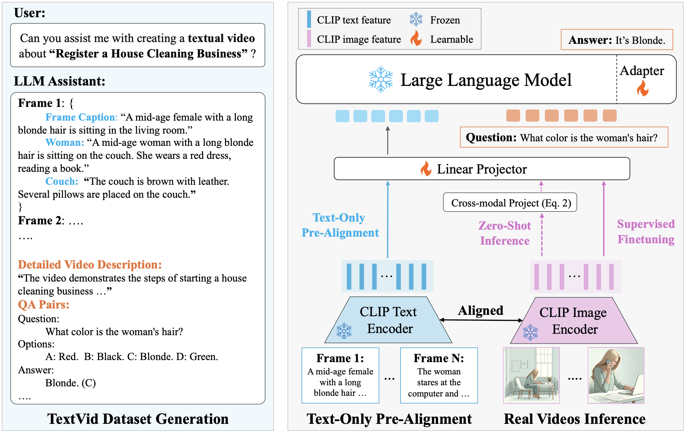

<div align="center">
<h1>TOPA: Extend Large Language Models for Video Understanding via Text-Only Pre-Alignment <a href="https://www.arxiv.org/pdf/2405.13911" target="_blank">(NeurIPS 2024 Spollight)</a>
</h1>
</div>

<div align="center">
  
</div>

## Data Preparation:
Prepare the data as follows.

**TextVID**: download TextVID at [google drive link](https://drive.google.com/file/d/12xocihCDYocHVtsdzymii3BnTJmlh430/view?usp=sharing)

**NeXTQA, STAR and TVQA**:
The prepocessed feautures are available at [here](https://github.com/mlvlab/Flipped-VQA).

**EgoScehma**:
Download raw videos from [EgoSchema](https://github.com/egoschema/EgoSchema). We provide prepocessed feature [TODO]

**MVBench**: 
Download raw videos from [Hugging Face](https://huggingface.co/datasets/OpenGVLab/MVBench).

**MSRVTT**:
Download raw videos from [MSRVTT](https://github.com/crux82/msr-vtt-it).

```
./data
   |─ nextqa
   |   |─ train.csv
   |   |─ val.csv
   |   └─ clipvitl14.pth
   |─ star
   |   :
   |─ tvqa
   |   :
   └─ egos
       :
```
## Model Preparation:
Prepare the model as follows.

**LLMs**: Download the pretrained Llama models from [Llama2](https://github.com/meta-llama/llama) and [Llama3](https://github.com/meta-llama/llama3).

**TOPA Checkpoints**: Download our [pretrained models](https://drive.google.com/file/d/1-Ce6LC-1TeKvUbg_BeCWzsps6XBf-dlG/view?usp=sharing)
```
./pretrained
   └─ llama2
   |    |─ 7B
   |    |   |─ consolidated.00.pth
   |    |   └─ params.json
   |    |─ 13B
   |    |   :
   |    |   :
   |    └─ tokenizer.model
   └─ llama3
        |─ 8B
        |   |─ consolidated.00.pth
        |   └─ params.json
        └─ tokenizer.model

./vqa_checkpoint
   └─ checkpoint_pretrain
        |─ llama2_7b
        |─ llama2_13b
        └─ llama3_8b
```

## Training & Evaluation
### Text-only Pre-alignment
```
./scripts/pretrain/llama2_7b.sh
```
### Zero-shot inference
```
./scripts/eval/zeroshot_eval_egos.sh
./scripts/eval/zeroshot_eval_nextqa.sh
./scripts/eval/zeroshot_eval_star.sh
./scripts/eval/zeroshot_eval_tvqa.sh
```
### Evaluate on MVBench
[mvbench.ipynb](demos/mvbench.ipynb)

### Evaluate on video captioning benchmarks
[MSRVTT.ipynb](demos/Eval_Cap_MSRVTT.ipynb)

[VATEX.ipynb](demos/Eval_Cap_VATEX.ipynb)

## Acknowledgements
This repo is built upon [Flipped-VQA](https://github.com/mlvlab/Flipped-VQA) and benefits from [LLaMA-Adapter](https://github.com/OpenGVLab/LLaMA-Adapter), [DeCap](https://github.com/dhg-wei/DeCap), [MVBench](https://github.com/OpenGVLab/Ask-Anything/blob/main/video_chat2/MVBENCH.md), [Llama2](https://github.com/meta-llama/llama) and [Llama3](https://github.com/meta-llama/llama3).


## Citations

```
@article{li2024topa,
  title={TOPA: Extend Large Language Models for Video Understanding via Text-Only Pre-Alignment},
  author={Li, Wei and Fan, Hehe and Wong, Yongkang and Kankanhalli, Mohan and Yang, Yi},
  journal={arXiv preprint arXiv:2405.13911},
  year={2024}
}
```
